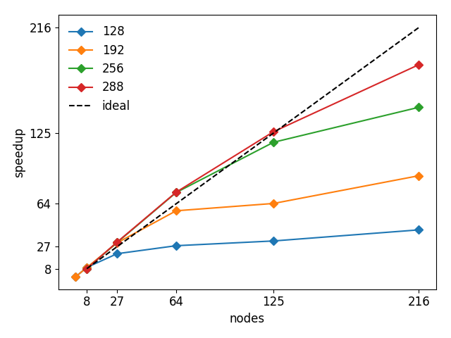
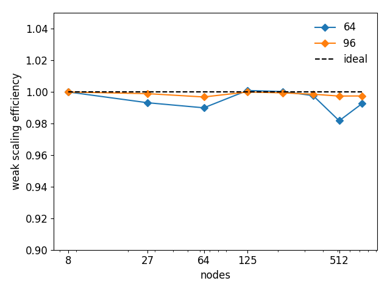
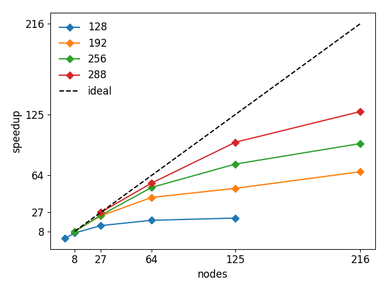
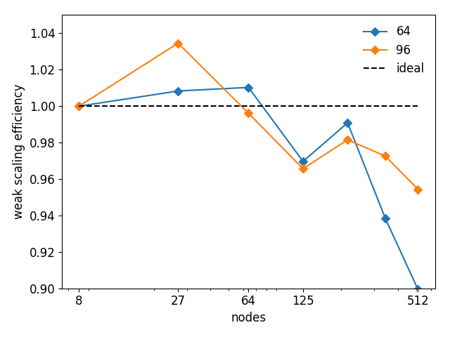
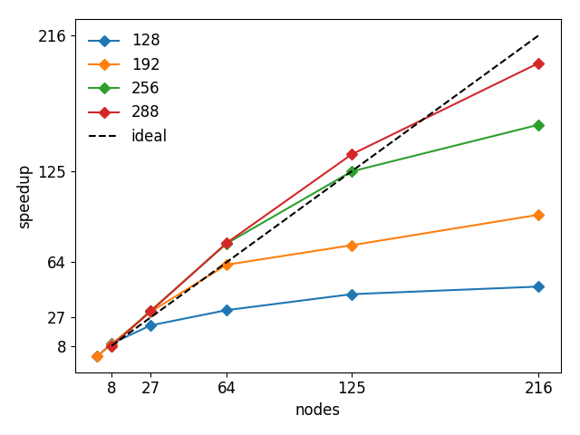

.. _user-bench:

Benchmarks
###########

The following benchmarks represent typical use cases of *uDeviceX*.
They were performed on the `Piz-Daint <https://www.cscs.ch/computers/piz-daint/>`_ supercomputer for both strong and weak scaling.
See in `benchmarks/cases/` for more informations about the run scripts.

Bulk Solvent
============

Periodic Poiseuille flow in a periodic domain in every direction, with solvent only.
Timings are based on the average time-step wall time, measured from the :any:`SimulationStats` plugin.

    strong scaling for multiple domain sizes

    weak scaling efficiency for multiple subdomain sizes

The weak scaling efficiency is very close to 1 thanks to the almost perfect overlapping of communication and computation.

Bulk Blood
==========

Periodic Poiseuille flow for blood with 45% Hematocrite in a periodic domain in every direction.
Timings are based on the average time-step wall time, measured from the :any:`SimulationStats` plugin.

    strong scaling for multiple domain sizes

    weak scaling efficiency for multiple subdomain sizes

The weak scaling efficiency is lower than in the solvent only case because of the complexity of the problem:

* Multiple solvents
* FSI interactions
* contact interactions
* Many objects
* Bounce back on membranes

The above induces a lot more communication than the simple solvent only case.

Poiseuille Flow
===============

Poiseuille flow between two plates (walls), with solvent only.
Timings are based on the average time-step wall time, measured from the :any:`SimulationStats` plugin.

    strong scaling for multiple domain sizes

.. figure:: ../images/weak_walls.png
    :figclass: align-center

    weak scaling efficiency for multiple subdomain sizes

Rigid Objects suspension
========================

TODO
