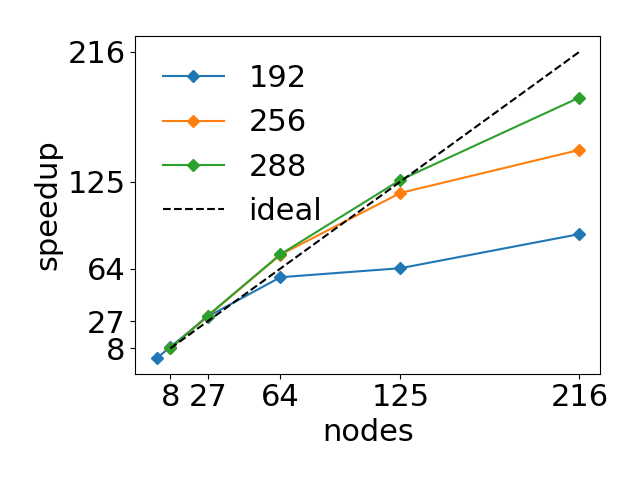
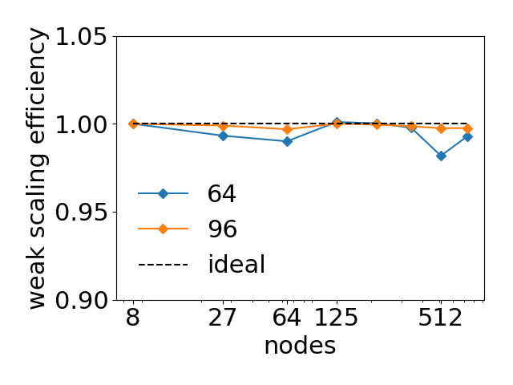
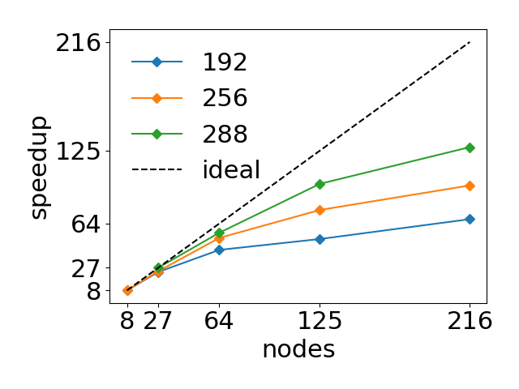
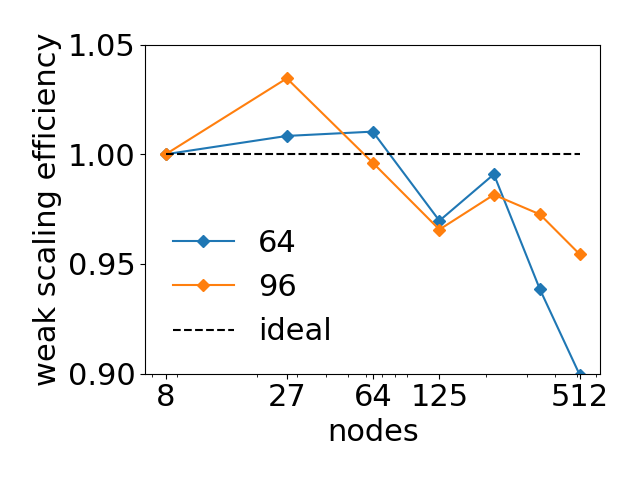

.. _user-bench:

Benchmarks
###########

The following benchmarks represent typical use cases of *uDeviceX*.
They were performed on the `Piz-Daint <https://www.cscs.ch/computers/piz-daint/>`_ supercomputer for both strong and weak scaling.
See in `benchmarks/cases/` for more informations about the run scripts.

Bulk Solvent
============

Periodic Poiseuille flow in a periodic domain in every direction, with solvent only.

	   
	   strong scaling for multiple domain sizes

	   
	   weak scaling efficiency for multiple subdomain sizes

Bulk Blood
==========

Periodic Poiseuille flow in a periodic domain in every direction with 45% Hematocrite.

	   
	   strong scaling for multiple domain sizes

	   
	   weak scaling efficiency for multiple subdomain sizes

Poiseuille Flow
===============

TODO

Rigid Objects suspension
========================

TODO
