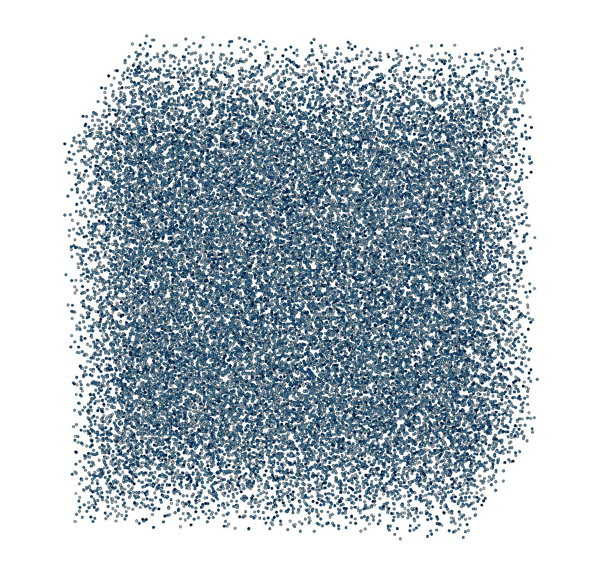

.. _user-tuto:

.. role:: python(code)
   :language: python

.. role:: bash(code)
   :language: bash

.. |ymr| replace:: **YMeRo**
   
Tutorials
##########

This section will guide you in the |ymr| interface step by step with examples.

Hello World: run YMeRo
**********************

We start with a very minimal script running |ymr|.

.. literalinclude:: ../../../tests/doc_scripts/hello.py
   :name: hello-py
   :caption: `hello.py`

The time step of the simulation and the domain size are common to all objects in the simulation,
hence it has to be passed to the coordinator (see its :py:meth:`constructor <_ymero.ymero.__init__>`).
We do not add anything more before running the simulation (last line).

.. note::
    We also specified the number of ranks in **each** direction.
    Together with the domain size, this tells |ymr| how the simulation domain will be splitted accross MPI ranks.
    The number of simulation tasks must correspond to this variable.

The above script can be run as:

.. code-block:: bash

    mpirun -np 1 python3 hello.py

Running :ref:`hello-py` will only print the "hello world" message of |ymr|, which consists of the version and git SHA1 of the code.
Furthermore, |ymr| will dump log files (one per MPI rank) which name is specified when creating the coordinator.
Depending on the ``debug_level`` variable, the log files will provide information on the simulation progress.

DPD solvent at rest
*******************

We will now run a simulation of particles in a periodic box interacting with :any:`DPD` forces.
We use a :any:`VelocityVerlet` integrator to advance particles in time.
The initial conditions are :any:`Uniform` randomly placed particles in the domain with a given density.

.. literalinclude:: ../../../tests/doc_scripts/rest.py
   :name: rest-py
   :caption: `rest.py`

This example demonstrates how to build a simulation:

#. **Create** the :py:class:`coordinator <_ymero.ymero>`
#. **Create** the simulation objects (particle vectors, initial conditions...)
#. **Register** the above objects into the :py:class:`coordinator <_ymero.ymero>` (see ``register*`` functions)
#. **link** the registered objects together in the :py:class:`coordinator <_ymero.ymero>` (see ``set*`` functions)

The above script can be run as:

.. code-block:: bash

    mpirun -np 2 python3 hello.py

.. note::
   The :ref:`rest-py` script contains plugins of type :py:class:`Stats <_ymero.Plugins.SimulationStats>`
   and  :py:class:`ParticleDumper <_ymero.Plugins. ParticleDumperPlugin>`,
   which needs a **postprocess** rank additionally to the **simulation** rank in order to be active.
   The simulation is then launched with 2 ranks.

   
The execution should output the `stats.txt` file as well as information output in the console.
Additionally, the particle positions and velocities are dumped in the ``h5`` folder.

    Snapshot of the particles dumped by executing the :ref:`rest-py` script.
    Visualisation made in `visit <https://wci.llnl.gov/simulation/computer-codes/visit>`_.

Adding walls
************

We extend the previous example by introducing :py:mod:`Walls <_ymero.Walls>` in the simulation.
Two components are required to form walls:

* a geometry representation of the wall surface.
  In |ymr|, wall surfaces are represented as zero level set of a Signed Distance Function (SDF).
  This is used to decide which particles are kept at the beginning of the simulation,
  but also to prevent penetrability of the walls by solvent particles.

* frozen particles, a layer of particles outside of the wall geometry which interact with the inside
  particles to prevent density fluctuations in the vicinity of the walls.

.. note::
   The user has to set the interactions with the frozen particles explicitly

.. literalinclude:: ../../../tests/doc_scripts/walls.py
   :name: walls-py
   :caption: `walls.py`

This example demonstrates how to construct walls:

#. **Create** :py:mod:`Walls <_ymero.Walls>` representation
#. **Create** :py:mod:`Interactions <_ymero.Interactions>` and an :py:mod:`Integrator <_ymero.Integrators>` to equilibrate frozen particles
#. **Create** the frozen particles with :py:meth:`_ymero.ymero.makeFrozenWallParticles`
#. **Set** walls to given PVs with :py:meth:`_ymero.ymero.setWall`
#. **Set** interactions with the frozen particles as normal PVs
   
The execution of :ref:`walls-py` should output the `stats.txt` file as well as information output in the console.
Additionally, frozen and solvent particles, as well as the walls SDF are dumped in the ``h5`` folder.

.. figure:: ../images/docs/walls.png
    :figclass: align-center
    :width: 50%

    Snapshot of the data dumped by executing the :ref:`walls-py` script.
    The white particles represent the solvent, the blue particles are the frozen wall particles and the surface is the 0 level set of the SDF file.

