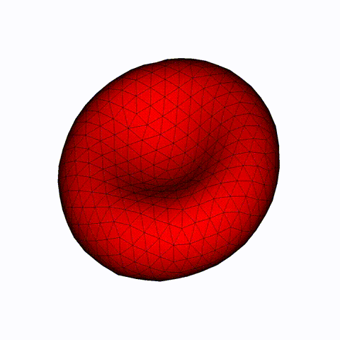
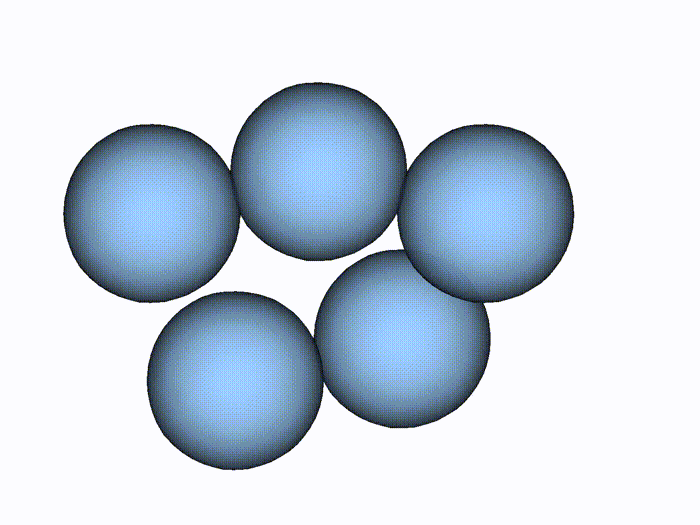

.. _user-tuto:

.. role:: python(code)
   :language: python

.. role:: bash(code)
   :language: bash

.. |mir| replace:: **Mirheo**
   
Tutorials
##########

This section will guide you in the |mir| interface step by step with examples.

Hello World: run Mirheo
***********************

We start with a very minimal script running |mir|.

.. literalinclude:: ../../../tests/doc_scripts/hello.py
   :name: hello-py
   :caption: `hello.py`

The time step of the simulation and the domain size are common to all objects in the simulation,
hence it has to be passed to the coordinator (see its :py:meth:`constructor <_mirheo.mirheo.__init__>`).
We do not add anything more before running the simulation (last line).

.. note::
    We also specified the number of ranks in **each** direction.
    Together with the domain size, this tells |mir| how the simulation domain will be split across MPI ranks.
    The number of simulation tasks must correspond to this variable.

The above script can be run as:

.. code-block:: bash

    mpirun -np 1 python3 hello.py

Running :ref:`hello-py` will only print the "hello world" message of |mir|, which consists of the version and git SHA1 of the code.
Furthermore, |mir| will dump log files (one per MPI rank) which name is specified when creating the coordinator.
Depending on the ``debug_level`` variable, the log files will provide information on the simulation progress.

DPD solvent at rest
*******************

We will now run a simulation of particles in a periodic box interacting with :any:`DPD` forces.
We use a :any:`VelocityVerlet` integrator to advance particles in time.
The initial conditions are :any:`Uniform` randomly placed particles in the domain with a given density.

.. literalinclude:: ../../../tests/doc_scripts/rest.py
   :name: rest-py
   :caption: `rest.py`

This example demonstrates how to build a simulation:

#. **Create** the :py:class:`coordinator <_mirheo.mirheo>`
#. **Create** the simulation objects (particle vectors, initial conditions...)
#. **Register** the above objects into the :py:class:`coordinator <_mirheo.mirheo>` (see ``register*`` functions)
#. **link** the registered objects together in the :py:class:`coordinator <_mirheo.mirheo>` (see ``set*`` functions)

The above script can be run as:

.. code-block:: bash

    mpirun -np 2 python3 rest.py

.. note::
   The :ref:`rest-py` script contains plugins of type :py:class:`Stats <_mirheo.Plugins.SimulationStats>`
   and  :py:class:`ParticleDumper <_mirheo.Plugins. ParticleDumperPlugin>`,
   which needs a **postprocess** rank additionally to the **simulation** rank in order to be active.
   The simulation is then launched with 2 ranks.

   
The execution should output the `stats.txt` file as well as information output in the console.
Additionally, the particle positions and velocities are dumped in the ``h5`` folder.

.. figure:: ../images/docs/rest.jpeg
    :figclass: align-center
    :width: 50%

    Snapshot of the particles dumped by executing the :ref:`rest-py` script.
    Visualization made in `visit <https://wci.llnl.gov/simulation/computer-codes/visit>`_.

Adding Walls
************

We extend the previous example by introducing :py:mod:`Walls <_mirheo.Walls>` in the simulation.
Two components are required to form walls:

* a geometry representation of the wall surface.
  In |mir|, wall surfaces are represented as zero level set of a Signed Distance Function (SDF).
  This is used to decide which particles are kept at the beginning of the simulation,
  but also to prevent penetrability of the walls by solvent particles.

* frozen particles, a layer of particles outside of the wall geometry which interact with the inside
  particles to prevent density fluctuations in the vicinity of the walls.

.. note::
   The user has to set the interactions with the frozen particles explicitly

.. literalinclude:: ../../../tests/doc_scripts/walls.py
   :name: walls-py
   :caption: `walls.py`

.. note::
   A :any:`ParticleVector` returned by :any:`makeFrozenWallParticles` is automatically registered in the coordinator.
   There is therefore no need to provide any :py:class:`InitialConditions` object.

This example demonstrates how to construct walls:

#. **Create** :py:mod:`Walls <_mirheo.Walls>` representation
#. **Create** :py:mod:`Interactions <_mirheo.Interactions>` and an :py:mod:`Integrator <_mirheo.Integrators>` to equilibrate frozen particles
#. **Create** the frozen particles with :py:meth:`_mirheo.mirheo.makeFrozenWallParticles`
#. **Set** walls to given PVs with :py:meth:`_mirheo.mirheo.setWall`
#. **Set** interactions with the frozen particles as normal PVs
   
The execution of :ref:`walls-py` should output the `stats.txt` file as well as information output in the console.
Additionally, frozen and solvent particles, as well as the walls SDF are dumped in the ``h5`` folder.

.. figure:: ../images/docs/walls.png
    :figclass: align-center
    :width: 50%

    Snapshot of the data dumped by executing the :ref:`walls-py` script.
    The white particles represent the solvent, the blue particles are the frozen wall particles and the surface is the 0 level set of the SDF file.

Membranes
*********

:py:class:`Membranes <_mirheo.ParticleVectors.MembraneVector>` are a set of particles connected into a triangle mesh.
They can interact as normal :py:class:`PVs <_mirheo.ParticleVectors.ParticleVector>` but have additional *internal* interactions, which we will use in this example.
Here we simulate one membrane with a given initial mesh "rbc_mesh.py" which can be taken from the ``data/`` folder of the repository.
The membrane is subjected to shear, bending, viscous and constraint forces and evolves over time thanks to a :any:`VelocityVerlet` integrator.

.. literalinclude:: ../../../tests/doc_scripts/membrane.py
   :name: membrane-py
   :caption: `membrane.py`

.. note::
   The interactions handle different combinations of shear and bending models.
   Each model may require different parameters.
   Refer to :py:meth:`_mirheo.Interactions.MembraneForces` for more information on the models and their corresponding parameters.

    Sequence data dumped by executing the :ref:`membrane-py` script.

    
Creating Cells with Different inner and outer liquids
*****************************************************

It is easy to extend the above simple examples into quite complicated simulation setups.
In this example we simulate a suspension of a few membranes inside a solvent.
We also show here how to split inside from outside solvents into 2 :any:`ParticleVectors <ParticleVector>`.
This is useful when the 2 solvents do not have the same properties (such as viscosity).
The example also demonstrates how to avoid penetration of the solvents through the membranes thanks to :py:mod:`_mirheo.Bouncers`.

Note that in this example, we also show that it is easy to add many different interactions between given particle vectors.

.. literalinclude:: ../../../tests/doc_scripts/membranes_solvents.py
   :name: membranes-solvents-py
   :caption: `membranes_solvents.py`

.. note::
   A :any:`ParticleVector` returned by :any:`applyObjectBelongingChecker` is automatically registered in the coordinator.
   There is therefore no need to provide any :py:class:`InitialConditions` object.

.. figure:: ../images/docs/membranes_solvent.gif
    :figclass: align-center
    :width: 50%

    Snapshots of the output files from :ref:`membranes-solvents-py`.
    White particles are the outer solvent, blue particles are inner.
    Two of the four membranes are cut for visualization purpose.

Creating Rigid Objects
**********************

Rigid objects are modeled as frozen particles moving together in a rigid motion, together with bounce back of particles, similarly to the walls.
In |mir|, we need to create a :any:`RigidObjectVector`, in which each rigid object has the **same** frozen particles template.
Generating these frozen particles can be done in a separate simulation using a :any:`BelongingChecker`.
This is shown in the following script for the simple mesh `sphere_mesh.off` which can be found in the `data/` folder:

.. literalinclude:: ../../../tests/doc_scripts/generate_frozen_rigid.py
   :name: generate-frozen-rigid-py
   :caption: `generate_frozen_rigid.py`

.. note::
   here we make use of `trimesh <https://github.com/mikedh/trimesh>`_ as we need some properties of the mesh.
   This would also allow to load many other formats not supported by |mir|, such as ply.

.. note::
   The saved coordinates must be in the frame of reference of the rigid object, hence the shift at the end of the script.

We can now run a simulation using our newly created rigid object.
Let us build a suspension of spheres in a DPD solvent:

.. literalinclude:: ../../../tests/doc_scripts/rigid_suspension.py
   :name: rigid-suspension-py
   :caption: `rigid_suspension.py`

.. note::
   We again used a :any:`BelongingChecker` in order to remove the solvent inside the rigid objects.

    Snapshots of the output files from :ref:`rigid-suspension-py`.

Going further
*************

A set of maintained tests can be used as examples in the `tests/` folder.
These tests use many features of |mir| and can serve as a baseline for building more complex simulations.
See also the :ref:`user-testing` section of this documentation. 
